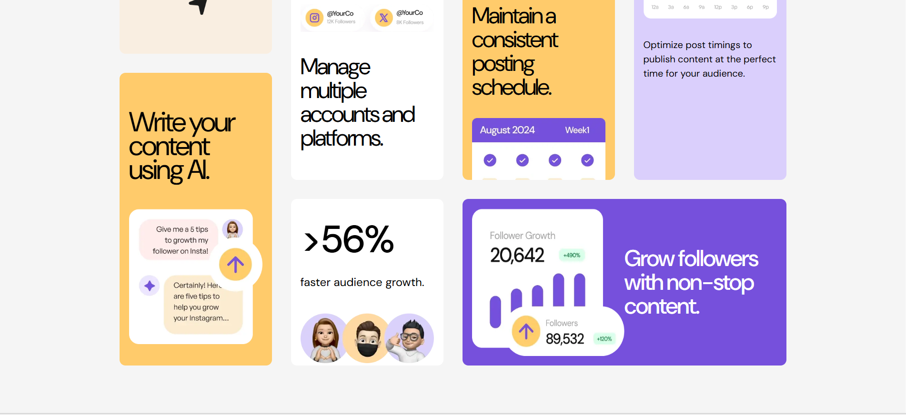

# bento-box-grid-style
Bento Box
A responsive Bento Box shaped grid. This is my second project using SCSS, and it includes HTML and SCSS/CSS.

Preview
🔗 Live Demo: [https://retal6.github.io/social-media-dashboard-challenge/](https://retal6.github.io/bento-box-grid-style/)

Bento Box Preview

Features
Responsive design (sigh... here we go again!)
Second project using SCSS
Bento Box grid made using grids! (ha ha... very ironic)

Technologies Used
HTML
SCSS / CSS
Project Structure
Important files include:

index.html — main HTML file
main.scss — main SCSS file
main.css — compiled CSS

What I Learned
I practiced using grids, specifically grid-template-areas. It took me blood, sweat and tears to actually find the most closely-related sizes, but it all worked out well!

I also challenged myself to work on responsive design, which is something I've found difficult before. It's not perfect yet, but I'm working on improving it.

And lastly, this project helped me sharpen my scss and researching skills, which are very crucial.

Future Improvements
Improve the responsive layout
Adjust the grid at different screen sizes(especially tablet since I'm not sure whether my approach was the right one.)

Author
Retal :)
